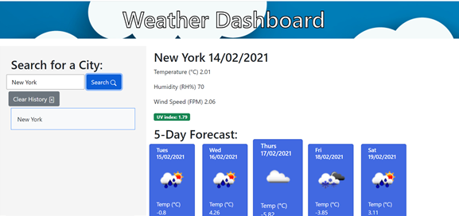

# Weather-Dashboard
A simple weather application that will return a five day forecast and current weather data for the specified city

## Contents
Section | Description
------------ | -------------
[Deployment](#Deployment) | Link to the Deployed Heroku Application
[Technologies](#Technologies) | Technologies Used
[Installation](#Installation) | Installation Information
[Usage](#Usage) | How to use the application
[Screenshots](#Screenshots) | Screenshots of the deployed application
[Licence](#licence) | Licence for the source code
[Questions](#Questions?) | Where you can reach me

## Deployment
OPEN WEATHER-DASHBOARD ---> [HERE](https://robbie-bridgwater.github.io/Weather-Dashboard/)

## Technologies Used

- HTML
- CSS
- Javascript
- AJAX

## Installation
 To run this application locally you will just need to clone the repository down to your local device and open it in a browser of your choice

## Usage
You may do either of the following:
* Follow the installation instructions above to run the app on your local device.
* Use the deployed application, found at the top of this README

## Screenshots
How the app should look when loaded --->

## License

> This project was created under the standard MIT licence.

> [Learn more about this licence.](https://lbesson.mit-license.org/)

## Questions?

Please contact me through my GitHub provided below if you have any questions relating to how the application works or any of my other projects

My GitHub username is Robbie-Bridgwater

Link to my GitHub Profile ---> https://github.com/Robbie-Bridgwater
